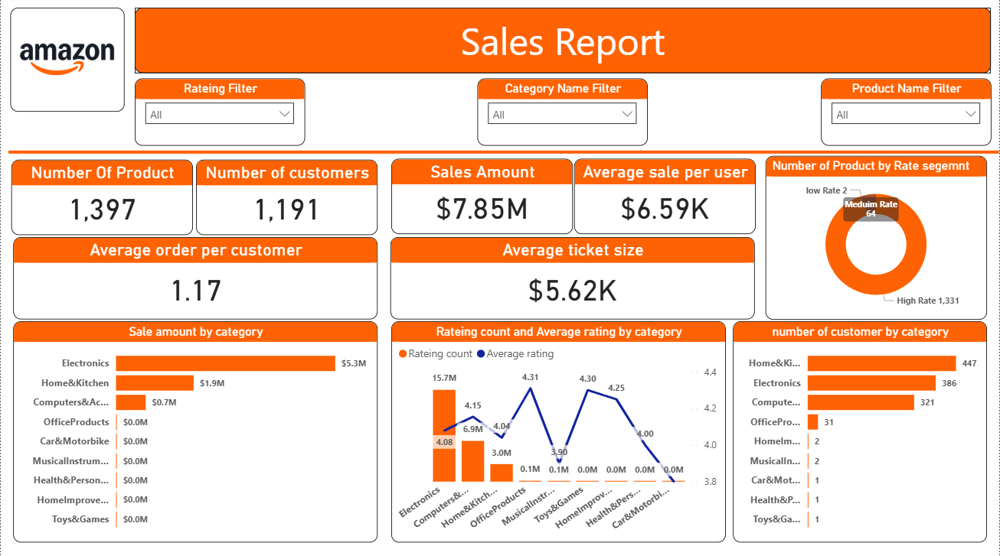

# 🛒 Amazon Sales Report Dashboard

## 📸 Dashboard Preview
Here’s a preview of the interactive **Power BI Amazon Sales Dashboard** included in this project:



---

## 📊 Project Overview
This project presents an interactive **Amazon Sales Report Dashboard** built using **Power BI**, designed to analyze key product, sales, and customer metrics from an Amazon dataset.  
The dashboard delivers valuable insights into product performance, category trends, and customer satisfaction to support strategic decision-making.

---

## 🧠 Key Insights & Findings
### 📈 Overall Metrics
- 🧾 **Total Products:** 1,397  
- 👥 **Total Customers:** 1,191  
- 💵 **Total Sales Amount:** \$7.85M  
- 🛍️ **Average Sale per User:** \$6.59K  
- 💳 **Average Ticket Size:** \$5.62K  
- 📊 **Average Orders per Customer:** 1.17  

### 🛍️ Category & Sales Analysis
- **Electronics** leads with **\$5.3M** in total sales, followed by **Home & Kitchen** with **\$1.9M**.  
- **Computers & Accessories** achieved **\$0.7M** in sales.  
- Category-level filtering allows for deeper performance exploration by segment.  

### ⭐ Customer & Rating Insights
- Ratings segmented into **High**, **Medium**, and **Low** to measure satisfaction distribution.  
- **Toys & Games** and **Health & Personal Care** achieved the **highest average ratings**.  
- **Electronics** dominates in both **review volume (15.7M)** and **sales**, indicating high customer engagement.  

### 🔎 Additional Highlights
- Dynamic slicers for **Category**, **Rating**, and **Product** allow custom exploration.  
- Interactive visuals showcase both **quantitative** (sales, ratings) and **qualitative** (review sentiment) insights.

---

## ⚙️ Tools & Technologies Used
- **Power BI Desktop** – Data modeling (DAX), interactive visualization, and KPI metrics  
- **Microsoft Excel** – Data cleaning, preprocessing, and transformation  
- **GitHub** – Project hosting and documentation  

---

## 📂 Dataset Description
The dataset includes key attributes:
- `product_id`, `product_name`, `category`, `discounted_price`, `actual_price`, `discount_percentage`,  
- `rating`, `rating_count`, `user_id`, `review_title`, `review_content`, `product_link`, etc.  

Data cleaning steps included:
- Removing duplicates and error fields  
- removing nulls
- unwanted columns
- creating customer profile dimension from the data
- Standardizing numeric formats for accurate aggregation  

---

## 📈 Key KPIs & DAX Measures
| KPI | Formula / Description |
|-----|------------------------|
| **Total Sales Amount** | `SUM('Amazon'[discounted_price])` |
| **Average Sale per User** | `Total Sales / DISTINCTCOUNT(User_ID)` |
| **Average Ticket Size** | `Total Sales / Number of Orders` |
| **Average Order per Customer** | `Orders / DISTINCTCOUNT(User_ID)` |
| **Average Rating per Category** | `AVERAGE('Amazon'[rating])` |

---

## 🎨 Dashboard Components
- **KPI Cards:** Show totals and averages (sales, customers, orders)  
- **Bar Charts:** Visualize sales & customer count per category  
- **Donut Chart:** Displays distribution of rating segments  
- **Combo Chart:** Shows average rating & rating count per category  
- **Slicers:** Filter by category, rating, or product  

---

## 🚀 How to Use
1. Clone the repository:
   ```bash
   git clone https://github.com/Mikemegally/amazon-sales-dashboard.git
